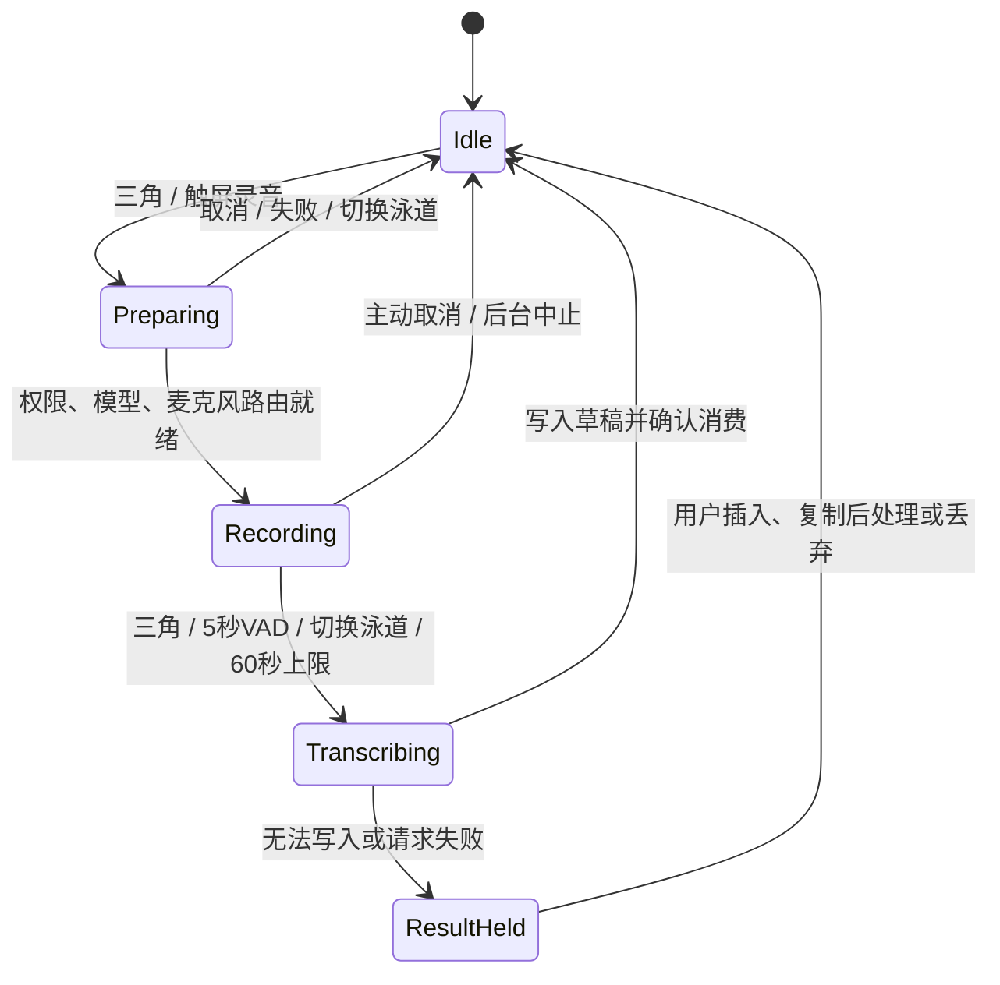
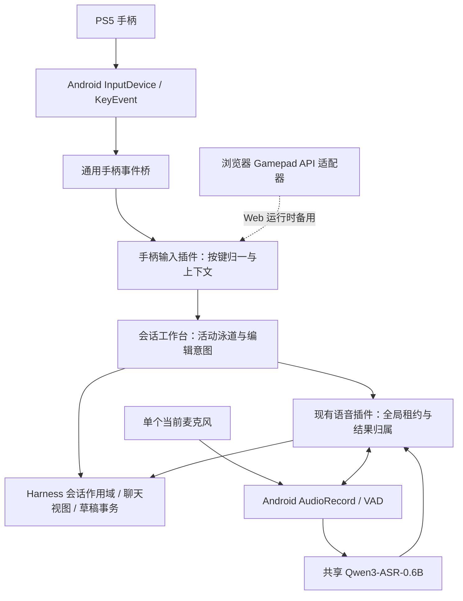

# PS5 手柄 + 单麦克风多会话工作台设计

日期：2026-09-09。状态：**设计完成，尚未实施或进行 PS5 实机验收**。

本方案替代上一轮“多个麦克风分别绑定泳道”的实施方向。目标是在小米平板上，用一支当前选中的麦克风和 PS5 DualSense，在最多四个同时可见的会话之间输入、修改文字；各 Agent 继续独立工作。

## 1. 结论与首版范围

可行。手柄决定“操作哪个会话”，麦克风负责采音，ASR 负责转文字，三者通过插件组合。切换会话不需要切换蓝牙设备，也不需要识别 DJI/LARK 的私有按键协议。

首版确定以下行为：

- 左侧提供四个会话位置，支持拖入和触屏选择；绑定四个就展示四条泳道。
- L1/R1 循环切换已绑定泳道，切换后聚焦对应输入框，保留各自草稿和光标。
- 三角按一次开始录音，再按一次结束并转录；沿用连续 5 秒无语音自动结束。
- 方块执行光标位置的退格，支持长按连续删除；不会清空整段草稿。
- **录音中切换泳道：结束旧录音，立即切换焦点，识别结果只回原会话。新泳道不会自动录音。**
- 转录只写草稿，绝不因结束录音、切换泳道或 VAD 结束自动发送。
- 默认本地 Qwen3-ASR-0.6B，共享一个模型实例、一个音频采集器。
- 首版沿用当前串行“录音 → 转录”链路；转录期间可以切换、阅读和打字，暂不能开始另一段录音。后台会话生成回复不受此限制。
- 工作台和手柄控制分别可选启用。现有语音插件继续独立可用；性能监控浮窗保持关闭。

“四会话同时工作”指四个会话持续订阅和独立执行，并不要求四路录音或四个 ASR 实例。

## 2. Homerail 中实际可参考的实现

检查的本地仓库：`/path/to/developer/work/HomerailRepos/homerail`，提交 `308f652cab608ed47810e6acba7a9d17cea9de53`。

| 参考文件 | 已有机制 | 本项目采用方式 |
|---|---|---|
| [voice-gamepad-router.ts](/path/to/developer/work/HomerailRepos/homerail/agent-ui/src/components/agent/voice-gamepad-router.ts) | 标准按钮索引、按上下文解析意图；三角 voice_toggle、L1/R1 前后切换 | 采用纯函数意图路由，改为 session/lane 操作 |
| [AgentVoiceCockpit.vue:4256](/path/to/developer/work/HomerailRepos/homerail/agent-ui/src/components/agent/AgentVoiceCockpit.vue:4256) | Gamepad API 轮询、按下边沿、连接提示、暂停交互、原生事件入口 | 采用边沿触发与生命周期管理；按事件来源做明确仲裁 |
| [native-gamepad-events.ts](/path/to/developer/work/HomerailRepos/homerail/agent-ui/src/utils/native-gamepad-events.ts) | 原生按钮/模拟轴 CustomEvent 数据约定 | 借鉴桥接模式，补 deviceId、序号、订阅代次与失焦复位 |
| [AgentVoiceCockpit.vue:2139](/path/to/developer/work/HomerailRepos/homerail/agent-ui/src/components/agent/AgentVoiceCockpit.vue:2139) | SVG 语音曲线构造 | 复用本项目已经移植的三曲线实现 |

Homerail 的方块在 canvas 上下文是预览，在 sessions 上下文是展开项目；**不能照搬其按键意图表**。本项目方块固定用于活动编辑器的退格。

Homerail 同时接收原生事件和浏览器轮询，使用共享 pressed 集合，模拟滚动有 80ms 原生事件抑制窗口。这里不依赖时间窗去重按钮：安卓桥启用后只采用原生来源，避免轮询覆盖 pressed 集合后造成一次按下触发两次。

本轮在上述仓库及 HomerailRepos 的 Kotlin/Java/Rust/C++ 源文件中没有检索到这些原生手柄事件的发送实现。因此，已确认的是前端接收与路由设计，不能据此宣称已有一份可直接搬用的 Android 驱动。

## 3. 界面与位置

### 3.1 工作台入口

保留插件名 `dsh-client-ui-voice-deck`，显示名改为“会话工作台”。左侧 session 区域顶部放一块紧凑的“工作台”区域，包含四个有编号的槽位。拖入的是 sessionId 引用，不复制会话、不移动项目文件、不改变归档状态。

触屏长按拖动提供占位提示；同时保留槽位的“选择会话”入口，不要求用户必须成功执行 HTML 拖放。会话已在另一槽位时执行移动，目标槽位已占用则交换两个位置，草稿跟随 sessionId。触屏直接点泳道也会激活并聚焦，行为与 L1/R1 一致。

工作台标题栏只保留标题与返回聊天，不显示手柄连接、单麦或本地模型标签；连接/模型信息在设置中查看。

工作台作为中间内容区的一个视图：进入时展示泳道，退出时恢复普通单会话聊天。进入工作台后每条泳道有自己的输入区，普通页面底部的全局输入框不再重复展示。其他会话仍留在左侧列表；绑定会话只加编号标记，首版不做隐藏列表项的 claims 行为，以减少导航意外和接口依赖。

### 3.2 四泳道布局

以下是结构示意，不是实现截图：

```text
左侧 session 区       中间视口：每屏两个泳道，横向滑动
┌ 工作台 ──────┐    ┌ 1 会话 A ──────┐ ┌ 2 会话 B · 当前 ┐   → C / D
│ [1 会话 A]   │    │ 消息 / 内部滚动│ │ 消息 / 内部滚动 │
│ [2 会话 B]   │    │                │ │                 │
│ [3 会话 C]   │    ├────────────────┤ ├ 波形：录音中 ───┤
│ [4 会话 D]   │    │ A 的草稿       │ │ B 的草稿 / 光标 │
└──────────────┘    └────────────────┘ └─────────────────┘
                    L2 会话栏 · L1/R1 切换 · △ 录音/结束 · □ 退格
```

- 每条泳道：固定头部、可滚动聊天内容、底部编辑器。活动泳道有细描边和“当前输入”标识；避免大面积高饱和底色。
- 按用户实机反馈（2026-09-09）修订：左侧四个槽位一行一个；中间四条泳道保持同一行，每屏恰好显示两条，左右滑动查看其余泳道。
- 四列单行采用显式 `grid-template-rows: minmax(0, 1fr)`；父容器高度来自可用视口减去标题/系统 inset，各层设置 `min-height: 0`。窗口不变时泳道高度不随消息增长。
- 每列宽度为 `(视口宽度 - 12px 间距) / 2`，横向滚动吸附到卡片边缘。L1/R1 每次切换一条，跳过空槽，末尾循环；切换只在必要时滚动以完整显示目标。手指横滑结束后，向右浏览选择右侧新出现的会话，向左浏览选择左侧新出现的会话并聚焦输入框。纵向翻聊天记录不改变活动会话。
- 编辑器沿用官方圆角、内边距、控件高度与文本行高，正文最高约 120 CSS px，超出内部滚动；只对窄列内的模型/权限选择器做宽度约束。波形在该泳道输入框正上方，沿用约 52px 的 SVG 窄条，不放侧栏、不悬浮到屏幕角落。
- 没有录音时不运行波形动画。转录时原泳道显示简短“正在转文字”；切到新泳道后，旧状态不会跟着焦点搬家。
- 消息区使用主聊天的渲染逻辑和节点订阅，保留 Markdown、代码、工具卡片、图片、历史加载和交互。不能继续使用导入插件的最后 80 条简化投影。
- 四条消息区独立保存滚动位置。上翻历史时新回复不拉回底部，显示“有新消息/回到底部”。聚焦输入框不改变消息滚动位置。
- Ctrl +/-/0 沿用现有内容字号机制。响应布局只因容器空间变化调整，不能恢复浏览器整页缩放。

### 3.3 输入焦点与软键盘

每个会话都有独立的官方编辑器状态。按用户后续要求，切换执行“更改活动 session → 等待目标编辑器 ready → focus({preventScroll:true}) → 显式选择草稿末尾并折叠 selection”。旧光标位置不再恢复，便于直接退格。L2 收放侧栏、录音按钮重新聚焦仍保留原 selection；当前泳道里用方向键移动光标的现有行为不变。

手柄切换要求文本输入焦点可立即接受键盘文字，但不主动弹起安卓软键盘；用户点输入框才主动显示软键盘。如果用户已经打开软键盘，切换时保持其可见状态，避免每次收起/弹出。WebView 的 IME 行为需要实机验证，不能把 DOM focus 等同于实现了软键盘控制；必要时增加带作用域的原生 IME 协调桥。

中文输入法处于 composition 阶段时，方块交给编辑器/输入法的删除语义，不直接改文本快照。若官方编辑器不能安全提供该操作，本次退格不执行并提示先完成拼字。切换则先请求正常结束 composition，提交失败时保留当前输入焦点，不能截断尚未确认的拼音。

设置、文件预览、权限窗口和其他模态界面拥有更高输入优先级。它们打开时工作台停止处理业务按键，不能因输入框曾聚焦就在弹窗后面录音或删字。

## 4. 手柄按键契约

映射按 PS5 按钮标识描述；Android keycode 和浏览器标准索引仅用于适配。具体设备上报需要实测。

| PS5 按钮 | Android 预期映射 | Web 标准索引 | 工作台行为 |
|---|---|---|---|
| L2 | KEYCODE_BUTTON_L2 / 104 | 6 | 展开/收起左侧会话栏，保留当前泳道与输入焦点 |
| L1 | KEYCODE_BUTTON_L1 / 102 | 4 | 上一个已绑定泳道，首尾循环 |
| R1 | KEYCODE_BUTTON_R1 / 103 | 5 | 下一个已绑定泳道，首尾循环 |
| 三角 △ | KEYCODE_BUTTON_Y / 100 | 3 | 空闲开始录音；录音中结束；准备/转录中只显示当前状态 |
| 方块 □ | KEYCODE_BUTTON_X / 99 | 2 | 删除选区，否则删除光标前一个字素/引用节点 |
| 圆圈 ○ | KEYCODE_BUTTON_B / 97 | 1 | 经原版 InputBar 提交当前泳道草稿；空草稿、拼字、录音/转录中不发送 |

L2/L1/R1/三角/圆圈只在新的按下边沿触发，忽略系统 repeat。L1/R1 不因长按快速跨越四个会话；只有一个会话时保留原位置并重新聚焦，零会话时提示“先添加会话”。事件按序处理，不自行猜测同时按 L1/R1 是新快捷键。

方块按下立即删除一次，持续按住 450ms 后每 90ms 删除一次。重复由 TS 单一计时器管理，忽略 Android repeat；松开、切换泳道、失焦、弹窗、断连、插件停用时立即清除。切换时若方块仍被按住，新泳道必须等它松开再重新按下才允许删除，不能把长按带过去。

删除使用官方编辑器事务与撤销栈；emoji、组合字符按可见字素处理，文件引用作为原子节点。不能 `draft.slice(0,-1)`，也不能伪造 DOM KeyboardEvent 后假设浏览器执行了默认退格。长按的一组删除合并为一个合理撤销单元。

○ 按新需求接入发送：只在按下边沿调用该泳道已挂载的官方 InputBar.submitDraft，沿用模型/权限/队列与附件逻辑。长按不重复；空草稿不会误触发停止 Agent。录音或转录尚未完成时提示先完成，不保存延迟发送意图。PS 键、叉键、触摸板不新增快捷键。

## 5. 录音、切换与结果归属

### 5.1 生命周期



`ResultHeld` 指文字结果或错误提示保留在原会话；模型请求失败但没有识别文字时只显示错误，不伪称有可恢复的转录。首版不持久保存原始录音，也不承诺进程被杀后恢复尚未完成的音频。

麦克风没有准备好之前只显示“准备中”，不能显示正在录音。完全静音到端点时结束且不发送模型请求。三角的手动结束和 VAD 同时发生时，仅接受一次结束，不能转录或插入两次。

### 5.2 切换时序示例

1. 在 A 泳道按三角，创建 `captureId=C1`，冻结 `sessionId=A`，申请全局语音租约。
2. A 录音中按 R1：TS 首先将 C1 标记为 finishing 并请求结束采音；活动泳道变成 B，B 编辑器立即恢复焦点。无需等 ASR 返回才切换。
3. C1 的识别在 A 的后台作用域内继续，A 显示转录状态。B 可以打字、删字、阅读和发送已有草稿。
4. B 此时按三角，显示“正在处理 A 的语音，完成后可录音”，不排队自动开麦。
5. C1 返回，只向 A 草稿追加文本。B 的草稿、光标和焦点保持不变。
6. 用户再次在 B 按三角才创建 C2。

Preparing 中切换则取消尚未开始的请求。切换目标与当前相同，不结束录音。转录中继续切换只改变焦点，不取消已有识别。

### 5.3 草稿落点与冲突

首版采用现有语音插件的**追加至原会话最新草稿末尾**语义；保留用户录音期间的手工编辑，不用旧快照覆盖整个输入框。方块仍按当前光标退格，两者语义在界面提示中明确区分。

写入使用当前 `draftRev` 和官方 `slash/input-insert-text` 契约，参考 [draft.ts](/path/to/developer/work/deepseek-harness-android/android-shell/plugins/dsh-android-voice-input/src/client/draft.ts)。引用节点在编辑器坐标中只占一位，不能用展开后的 clipboard 文本长度作插入坐标。

若 revision 冲突，可重新读一次最新状态并重试；仍冲突、处于 composition/其他不可编辑阶段、会话已删除时，将结果放入原 sessionId 的“待插入语音”记录，提供插入/复制/丢弃。结果持久化成功或编辑器确认插入后才 acknowledge 原生结果，按 captureId 去重。持久化失败时保留当前结果并阻止覆盖，不能先清空再提示失败。

移除泳道不会删除会话草稿。录音中的会话被移出工作台，先结束录音，结果仍归该 session；若会话已经删除，不寻找其他泳道替代它，将可用文字放入工作台的未投递结果入口。插件关闭后再次开启，也能看到已持久化但未插入的文字。

同一 session 移动槽位不改变录音归属。用于订阅和波形的 lane generation 与用于识别任务的 capture generation 分开：槽位重用使旧 UI 回调失效，但不误伤原 session 的合法结果。

任务持有独立于泳道视图的会话租约，直到完成投递或将文字存入待插入记录才释放。会话从四格移出后，释放的是展示订阅，不得让正在结束的录音失去结果接收者。所有停止、取消、写入失败路径都通过统一 finally 收尾；未投递文字记录不依赖一个必须持续挂载的 React 组件保存。

## 6. 当前麦克风的含义

一份全局选择，默认跟随系统当前输入；界面只显示当前设备和录音状态，不再出现“设备 1 → 泳道 1”映射。连接 PS5 不应把麦克风自动改为手柄麦克风。

Android 层使用 AudioManager/AudioRecord，开始后读取实际 routed device，确认实际来源再显示设备名。`setPreferredDevice` 的成功与界面下拉选择不等于实际路由成功。[AudioRecord 官方文档](https://developer.android.com/reference/android/media/AudioRecord)描述首选设备设置与实际录音路由查询。

蓝牙设备按系统通信音频路由能力处理；API 31+ 的 setCommunicationDevice 需要从可用通信设备选择并等待路由完成，停止后恢复应用临时持有的模式/通信选择；API 26–30 走已有兼容路径或明确不提供指定蓝牙路由，不能无版本守卫调用。具体 AUDIO_SOURCE 与 Bluetooth SCO 的组合必须用 DJI 实测，不能假设现有 VOICE_RECOGNITION 默认源一定走外接麦。[Android 音频路由指南](https://developer.android.com/develop/connectivity/bluetooth/ble-audio/audio-manager)可作为平台适配依据。

输入设备中途断开或实际路由改变，立即结束当前段，标记“输入设备已变化”，仅转录变化前已确认来自原设备的有效样本；无法确认边界则取消该段并说明。下一次录音重新确认来源，不静默继续录平板内置麦。必要权限仍按现有 RECORD_AUDIO 及目标 Android 蓝牙 API 的要求处理，手柄普通按键接收本身不引入私有 HID 权限流程。

此前两个 DJI 蓝牙连接的枚举结果只证明系统当前激活一支；本方案无需并行采集另一支。模型仍在平板本地运行，不改用远程模型服务器。

## 7. 插件和原生边界



| 组件 | 职责与启停 |
|---|---|
| `dsh-client-ui-voice-deck` | 四泳道布局、会话绑定、活动泳道、独立草稿与滚动、工作台入口；停用释放自己的 UI/订阅 |
| 新 `dsh-client-input-gamepad` | 标准化按钮、输入上下文、重复/去重、向活动输入目标发语义意图；显示名“手柄输入”，可独立关闭 |
| 现有 `dsh-android-voice-input` | 麦克风按钮、波形、本地模型、共享录音服务；工作台通过服务调用，不能再创建第二套 ASR/消费者 |
| Android 壳 | 按键来源、连接状态、录音、音频路由与生命周期；不认识 L1“下一个会话”等产品语义 |
| 兼容插件/构建期补丁 | 补齐目标运行时的多会话 view binding 与必要槽位/编辑器操作；版本检查、失败门禁、变更清单 |

当前不接入 WebHID 多麦路由。旧多麦插件与未适配 Deck 副本已本地归档；仓库保留活动实现的来源、许可证和公共接口参考，不维护第二套未接入源码。

设置中的“会话工作台”“手柄输入”“语音输入”各有启停入口。语音输入仍默认 0.6B，不暴露模型路径、端口等实现参数；手柄设置首版显示固定按键说明及连接状态。工作台可在关闭手柄/语音后作为纯文本多会话视图使用，插件缺失时能力明确禁用而不整体崩溃。

手柄插件关闭只清除按键监听与重复计时，不中止 Agent；若正在由它发起录音，结束这一段并允许原会话接收结果。语音插件关闭遵循现有取消语音行为并清理采音/模型资源；工作台关闭先取消它持有的活动语音任务，保存已到达的待插入文字，再释放订阅。其他插件拥有的租约不被误释放。

## 8. 待新增的接口草案

以下是设计契约，不是已经存在的 SDK 方法。实现前需核对运行时真实导出。

```ts
type DeckIntent = 'previous-lane' | 'next-lane' | 'toggle-recording' | 'delete-backward';

interface GamepadButtonEvent {
  source: 'android' | 'web';
  deviceId: string; // 当前连接身份，不当作永不变化的持久硬件 ID
  epoch: number;   // 连接/订阅代次，失焦或重连后旧事件失效
  seq: number;
  button: 'l1' | 'r1' | 'north' | 'west';
  pressed: boolean;
  repeat: boolean;
  timestampMs: number; // 该来源的单调时钟，不跨来源直接比较
}

interface CaptureOwner {
  captureId: string;
  sessionId: string;          // 创建后不可变
  generation: number;         // 取消/重建任务时变化
  origin: 'composer' | 'deck';
}

interface SessionEditorAdapter {
  focus(options: { preventScroll: true; keyboard: 'preserve' }): Promise<boolean>;
  deleteBackward(): boolean; // 编辑器事务，含选区/字素/引用/IME 规则
  appendTranscript(owner: CaptureOwner, text: string): Promise<'inserted' | 'held'>;
}
```

原生只发规范按钮及来源信息；TS 按当前上下文转成 DeckIntent。Android 接收标准按钮可用 Activity.dispatchKeyEvent 并检查 InputDevice 来源；未消费的按键交给系统。它适用于普通应用，无需为了几个按钮引入游戏引擎。[Android 手柄输入指南](https://developer.android.com/games/sdk/game-controller/controller-input)给出了按键、轴事件、设备来源与 Activity 接收方式。

消费状态不能依赖异步 JS 返回：TS 在工作台/弹窗状态变化时向原生设置可处理的按钮订阅及 epoch；原生仅在前台、受信任 Harness 页面、有效订阅下消费对应 down/up。页面导航、暂停或重建时先撤销订阅，并使用有失效期限的租约防止页面异常后长期吞键。已消费的 down 对应 up 也要正确收尾。

安卓桥能力握手成功后，整个安卓手柄适配器禁止 Web Gamepad 业务轮询；独立 Web 运行时才启用浏览器适配器。Web 非 standard 映射默认不猜测按钮，需要明确支持档案。断开或失焦统一 reset，重连时处于按住状态的按钮先等松开再启用。首版仅一个控制手柄拥有输入权，第二个连接不会抢占当前设备。

## 9. 现有实现必须先解决的缺口

1. **多会话订阅**：导入包要求的 `sessions.acquireStage` 在当前打包 runtime 中不存在。为每个 session 建立稳定租约，切活动泳道不卸载另三条；按 sessionId 差量管理，不能在列表更新时全量重绑。
2. **侧栏入口**：`sidebar.workspaces.before` 在当前打包 ui-workspace 中不存在。按当前版本补最小挂载接口；首版不采用 workspaceSessionClaims，减小补丁范围。
3. **消息复用**：导入的 `projectChat`/`VoiceLaneItem` 改为标准 ChatView 所需的会话绑定。不能仅 import 一个组件就假定它已支持非当前会话；要验证 actions、加载历史、工具审批都路由到对应 sessionId。
4. **编辑器操作**：当前已核实的是追加文字接口，尚未核实外部 focus/selection/delete 的完整公开能力。先做 adapter 原型；缺接口时用可审计兼容补丁暴露命令，不做 DOM 文本替换。
5. **语音所有权**：现有 VoiceSession.attach 最后一个视图解绑会 cancel，无法直接用于切换后仍转录。把任务生命周期从视图引用计数移到共享 service，UI 仅订阅；普通输入框和 Deck 共用一个结果消费者。
6. **ASR 依赖**：删除 Deck 对缺失 `dsh-client-voice-asr` 和 LARK 控制事件的运行依赖，接入现有 Android 语音服务。不模拟一个并不存在的 WebSocket 音频流后端。
7. **自动发送**：移除导入版 stop 后默认 `session.prompt(..., 'queue')` 行为。用户明确发送时才通过该泳道的标准提交操作执行，并继承 Harness 的运行中/队列规则。
8. **原生手柄桥**：当前 MainActivity 只有 Ctrl 字号转发，新桥需共存并独立生命周期管理，不改变 Ctrl +/-/0 行为。

导入兼容边界以上述接口约束为准。上游 checkout 保持只读；补丁按实际包内容指纹验证，不能用 CLI 版本推断所有子包接口。

## 10. 生命周期和失败处理

| 情况 | 约定 |
|---|---|
| 用户拒绝麦克风权限/模型缺失 | 原泳道提示原因，释放全局语音租约，仍可键盘输入 |
| 手柄断开 | 清除按住状态；如它发起的录音还在进行则结束并转录至原会话；不自动重启 |
| App 退后台/锁屏 | 立即撤销手柄订阅、停止录音并取消当前语音任务，沿用现有前台限定；已有草稿保留 |
| ASR 出错 | 原泳道显示错误并解锁全局服务，不清空原草稿；未取得文字则需要重录 |
| 转录结果迟到、任务已取消 | generation 不匹配则丢弃，不能写入新任务或新会话 |
| 会话移出/槽位交换 | 只调整布局订阅，结果按原 sessionId 投递；不可用结果进入未投递入口 |
| 输入框暂不可编辑 | 保留待插入文字，不自动提交、不覆盖新草稿 |
| 页面刷新或进程重启 | 恢复合法会话绑定、活动位置、官方草稿和已落盘待插入文字；不恢复开麦 |
| 相同录音结束事件重复/结果重发 | captureId 幂等，只有一次结束和一次插入 |

## 11. 实施里程碑

| 阶段 | 交付 | 完成条件 |
|---|---|---|
| M1：平台与编辑器原型 | 原生手柄桥、纯函数按键路由、两个会话的 focus/delete adapter | 实机四键识别；输入法/emoji/引用节点编辑正确；无双重触发 |
| M2：四会话工作台 | 独立构建、设置开关、拖入/触屏选择、标准聊天绑定和固定高度布局 | 四会话持续更新、独立滚动、草稿与 selection 不串道 |
| M3：单麦语音路由 | 共享语音 service、冻结 CaptureOwner、切换结束录音、待插入文字保留 | A 录音切 B 后文本只到 A；VAD/重复 stop/卸载没有重复写入 |
| M4：平板完整验收 | APK、版本/指纹记录、手柄 + DJI 真实输入证据、性能和生命周期报告 | 第 12 节的关键用例全部通过，并记录失败/限制 |

本轮只交付设计文档。实现阶段修改源码时，同步更新 android-shell/AGENTS.md 及模块、桥、构建/坑点文档；不把设计中的接口登记为已发布能力。

后续性能优化单独评估“采音与推理解耦”：上一段 ASR 时允许新泳道采下一段，共享模型串行处理并设有界队列。只有记录的等待时间明显影响体验才增加这层复杂度。当前 llama.cpp 接口的 SSE 文字输出不代表支持连续音频流式输入，因此首版不承诺边说边获得最终文本。

## 12. 验收用例与度量

以下为设计验收清单；已执行结果与尚未覆盖项以 `PS5-VOICE-DECK-MILESTONE.md` 为准。模拟按钮可测试状态机，但 PS5 蓝牙按键、DJI 实际音源和 IME 必须在平板上验证。

| 编号 | 操作 | 通过标准 |
|---|---|---|
| A01 | 拖入四个不同会话，触屏也分别加入一次 | 四个正确绑定；重复会话移动/交换而非复制 |
| A02 | 连按 L1/R1 100 次，包含首尾及空槽位 | 每次只移动一格有效会话；输入焦点同步，草稿不丢 |
| A03 | 方块删除中文、emoji、选区和文件引用 | 按编辑器语义删除，撤销可恢复，无损坏引用 |
| A04 | 长按方块时切泳道/断连/打开设置 | 重复立即停止，新泳道文字不会继续被删除 |
| A05 | 安卓原生与 Web Gamepad 同时可见 | 一次三角只开始一次录音，不立即又结束 |
| A06 | A 录音说明确句子，R1 切 B 并打字 | A 收到一次完整有效转录，B 文字/光标不被改变 |
| A07 | 结束按钮与 5 秒 VAD 接近同时触发 | 一次模型请求、一次结果消费；纯静音不请求模型 |
| A08 | 转录中反复三角、快速换槽位/移出会话 | 不创建隐式录音，不把旧结果写给槽位新会话 |
| A09 | 录音期间手动修改原草稿、改变 draftRev | 追加到最新草稿或明确保留待插入，绝不覆盖 |
| A10 | 四会话都生成回复，上翻其中一条历史 | 其余正常更新；历史不跳底；工具操作只影响所属会话 |
| A11 | 横竖屏、软键盘显示、Ctrl 字号变化 | 固定卡片内部滚动，输入区和波形不覆盖邻居，无页面缩放 |
| A12 | 拒权、后台、锁屏、手柄/DJI 断连、模型失败 | 状态可恢复、没有遗留采音/按键重复，已有草稿保留 |
| A13 | 分别禁用手柄/工作台/语音，再冷启动 | 开关与绑定持久化；普通聊天可用；性能浮窗仍关闭 |
| A14 | 关闭/重启后恢复已识别但未插入文字 | 原会话归属不变；不可用会话有未投递入口；不会自动发送 |

建议体验目标：热态按键到活动描边/DOM 焦点的 P95 ≤ 100ms；四条流式回复时切换目标 P95 ≤ 150ms；方块松开后不再发生新的应用层重复删除。它们是验收目标，不是已测性能承诺。

记录四类耗时：按键至 UI、开始请求至实际采音、最后语音至 VAD 结束、结束采音至文字入草稿；模型冷启动单列。5 秒 VAD 等待和 ASR 耗时必须分开呈现。记录 P50/P95、样本数、模型/快照/APK 指纹及音频路由；不将平均模型耗时当成端到端输入延迟。

关键正确性要求：串会话写入为零、重复发送为零、已有草稿被覆盖为零。调试数据写测试日志，记录匿名任务 ID、状态和时序即可，不开启用户已关闭的监控浮窗。


### 泳道菜单与触屏滚动补充（2026-09-09）

`/` 和 `@` 使用官方作用域候选菜单。composer 外层必须 overflow:visible，文字滚动由原版编辑器承担；菜单可用高度由每条泳道的标题下沿和输入卡片上沿测量，随 ResizeObserver 更新，弹层不跨越泳道。

Android 内层纵向消息 scroller 会截住横滑。聊天区声明 pan-y/pinch-zoom，12px 方向判定后仅横向手势由插件滚动外层并吸附，纵向与双指缩放保留原生行为。宽代码块/表格横向滚动优先留在对应元素，不切泳道。


### 横滑惯性（2026-09-09 后续修正）

松手不立即恢复 CSS scroll-snap。最近约 100ms 的移动位移决定释放速度，抬手回调不作为零速度样本，超过 120ms 无移动才清除惯性，投影 240ms 后选择目标；快速短甩至少推进一条边界，慢拖与停顿按距离。260–460ms 三次 Hermite 动画保留释放速度并减速至零，完成后恢复吸附与焦点。边界限位，不反弹到不存在的泳道；新触摸中断续拖，手柄与尺寸变化取消旧惯性。纵向聊天和宽代码块的独立手势规则保留。
